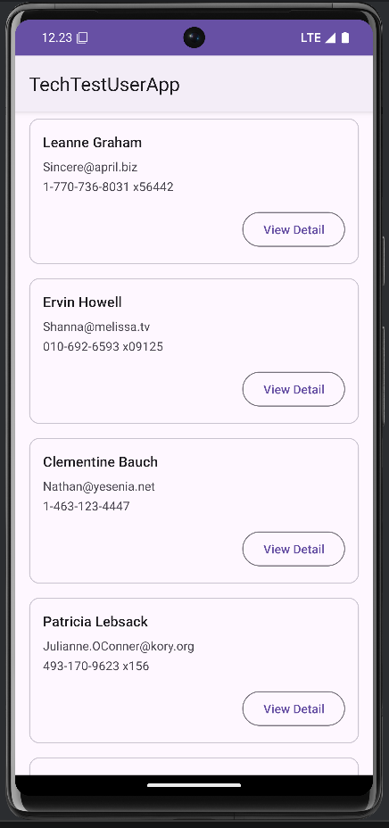
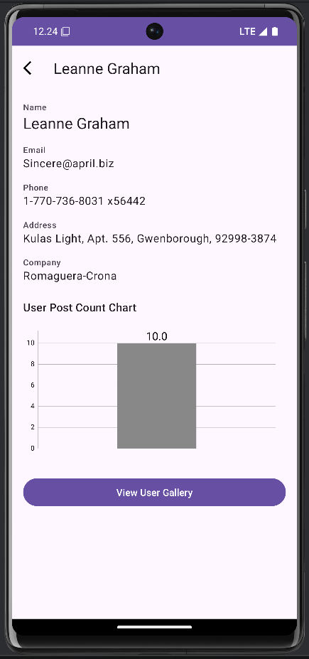
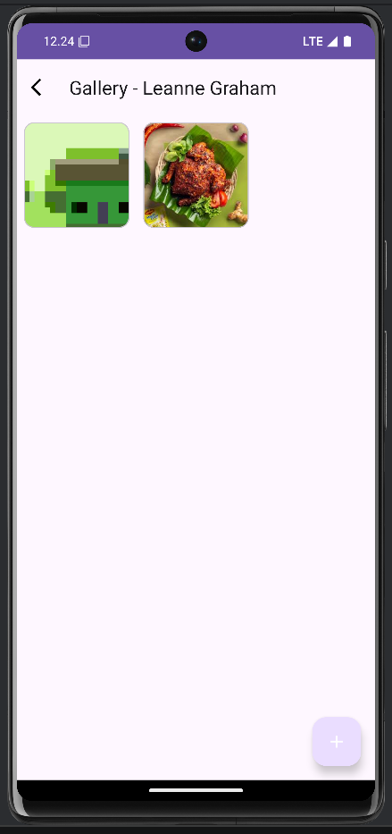

# Tech Test User App

**Tech Test User App** adalah aplikasi Android yang menampilkan daftar pengguna dari API publik, memungkinkan pengguna melihat detail, dan mengelola galeri media (foto/video) pribadi untuk setiap pengguna.

Aplikasi ini dibangun dengan arsitektur MVVM modern, menggunakan Kotlin, Coroutines, Flow, Hilt, Retrofit, dan Room, serta menyertakan fungsionalitas offline-first.

## 🚀 Download

Anda dapat mengunduh file `.apk` yang dapat diinstal langsung dari rilis terbaru kami.

[Download APK (v1.0.0)](https://github.com/dzikrimutawakkil/user-gallery-app/releases/download/v1.0.0/TechTestUserApp.V1.0.apk)

---

## 📸 Pratinjau (Screenshots)

| Daftar Pengguna | Detail Pengguna |                 Galeri                  |
| :---: | :---: |:---------------------------------------:|
|  |  |  |
---

## ✨ Fitur

* **Daftar Pengguna (User List)**
    * Mengambil daftar pengguna dari API.
    * **Offline Caching:** Menyimpan pengguna di database Room untuk akses offline.
    * **Deteksi Jaringan:** Menampilkan status "Offline Mode" saat tidak ada koneksi internet.
    * **Pull-to-Refresh:** Fungsionalitas geser untuk menyegarkan data.
    * **Loading State:** Menampilkan animasi shimmer saat data dimuat.

* **Detail Pengguna (User Detail)**
    * Menampilkan informasi mendetail tentang pengguna (alamat, perusahaan, dll.).
    * **Visualisasi Data:** Mengambil jumlah total *postingan* pengguna dan menampilkannya dalam Bar Chart.
    * Toolbar kustom dengan tombol kembali dan nama pengguna.

* **Galeri Pengguna (User Gallery)**
    * Galeri media (foto & video) per pengguna yang persisten (disimpan di Room DB).
    * **Tambah Media:** Memungkinkan pengguna menambahkan gambar/video baru dari **Kamera** atau **Galeri**.
    * **Penyimpanan Internal:** Menyalin media yang dipilih ke penyimpanan internal aplikasi agar tetap ada.

* **Pratinjau Media (Media Preview)**
    * **In-App Viewer:** Membuka pratinjau media *di dalam aplikasi* saat thumbnail galeri diketuk.
    * **ViewPager2:** Memungkinkan pengguna untuk menggeser (swipe) antar foto dan video.
    * **Video Playback:** Memutar video langsung di dalam layar pratinjau.

---

## 🛠️ Tech Stack & Arsitektur

* **Bahasa:** [Kotlin](https://kotlinlang.org/)
* **Arsitektur:** [MVVM](https://developer.android.com/topic/architecture) (Model-View-ViewModel)
* **Async:** [Kotlin Coroutines](https://kotlinlang.org/docs/coroutines-overview.html) & [Flow](https://kotlinlang.org/docs/flow.html)
* **Dependency Injection:** [Hilt](https://dagger.dev/hilt/)
* **Networking:** [Retrofit 2](https://square.github.io/retrofit/) & [OkHttp 3](https://square.github.io/okhttp/)
* **Database:** [Room](https://developer.android.com/training/data-storage/room)
* **Image Loading:** [Coil](https://coil-kt.github.io/coil/)
* **UI Components:**
    * [AndroidX Activity & Fragment KTX](https://developer.android.com/kotlin/ktx)
    * [Material Components](https://material.io/develop/android) (CardView, Button, Toolbar)
    * [ViewPager2](https://developer.android.com/guide/navigation/navigation-ui) & [RecyclerView](https://developer.android.com/guide/topics/ui/layout/recyclerview)
    * [SwipeRefreshLayout](https://developer.android.com/develop/ui/views/touch-and-input/swipe-to-refresh)
* **Charting:** [MPAndroidChart](https://github.com/PhilJay/MPAndroidChart)
* **Loading UI:** [Shimmer (Facebook)](https://facebook.github.io/shimmer-android/)

---

## 🚀 Instalasi

1.  Clone repositori ini:
    ```bash
    git clone [https://github.com/dzikrimutawakkil/user-gallery-app.git](https://github.com/dzikrimutawakkil/user-gallery-app.git)
    ```
2.  Buka proyek di [Android Studio](https://developer.android.com/studio).

3.  Jalankan aplikasi (Run 'app').

